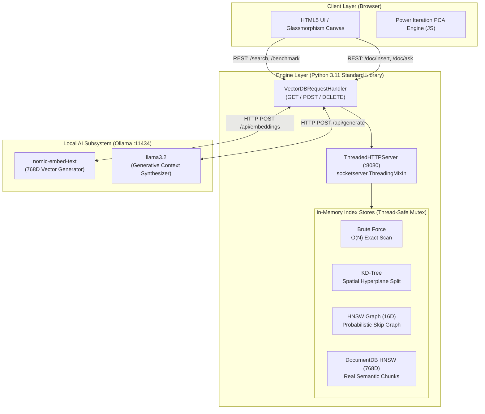

# 🚀 Rag-Db: VectorDB Engine & RAG Visualizer — Ultimate Interview Preparation Master Guide

---

## 📌 Table of Contents
1. [Executive Summary & 30-Second / 2-Minute Elevator Pitches](#1-executive-summary--elevator-pitches)
2. [End-to-End System Architecture & Request Lifecycle](#2-end-to-end-system-architecture--request-lifecycle)
3. [Deep-Dive: Vector Math & Distance Metrics](#3-deep-dive-vector-math--distance-metrics)
4. [Deep-Dive: Search Algorithms from First Principles](#4-deep-dive-search-algorithms-from-first-principles)
   - [4.1 Brute Force (Flat Index)](#41-brute-force-flat-index)
   - [4.2 KD-Tree (Spatial Hyperplane Partitioning)](#42-kd-tree-spatial-hyperplane-partitioning)
   - [4.3 HNSW (Hierarchical Navigable Small World Graph)](#43-hnsw-hierarchical-navigable-small-world-graph)
5. [Deep-Dive: Dimensionality Reduction & Visualizer (Power Iteration PCA)](#5-deep-dive-dimensionality-reduction--visualizer-power-iteration-pca)
6. [Deep-Dive: Offline RAG Pipeline & Local AI Integration](#6-deep-dive-offline-rag-pipeline--local-ai-integration)
7. [Deep-Dive: Backend Engineering, Concurrency & Thread-Safety](#7-deep-dive-backend-engineering-concurrency--thread-safety)
8. [Deep-Dive: DevOps, Docker Containerization & CI/CD Pipeline](#8-deep-dive-devops-docker-containerization--cicd-pipeline)
9. [Comprehensive 50+ Technical Interview Q&A Bank](#9-comprehensive-50-technical-interview-qa-bank)
   - [Category A: High-Level Architecture & System Design](#category-a-high-level-architecture--system-design)
   - [Category B: Data Structures & Algorithmic Internals (HNSW & KD-Tree)](#category-b-data-structures--algorithmic-internals-hnsw--kd-tree)
   - [Category C: Vector Math & High-Dimensional Geometry](#category-c-vector-math--high-dimensional-geometry)
   - [Category D: RAG, Embeddings & LLM Integration](#category-d-rag-embeddings--llm-integration)
   - [Category E: Python Concurrency, OS & Systems Programming](#category-e-python-concurrency-os--systems-programming)
   - [Category F: DevOps, Docker & CI/CD](#category-f-devops-docker--cicd)
   - [Category G: Scalability, Production Trade-offs & Future Improvements](#category-g-scalability-production-trade-offs--future-improvements)
10. [Whiteboard / Live Coding Quick Reference](#10-whiteboard--live-coding-quick-reference)

---

## 1. Executive Summary & Elevator Pitches

### ⏱️ 30-Second Elevator Pitch
> *"I built **Rag DB**, a lightweight, zero-dependency Vector Database engine and private RAG system from scratch in Python 3.11. Rather than treating vector databases as black-box third-party services like Pinecone or Chroma, I engineered the underlying spatial indexing data structures—specifically a **Hierarchical Navigable Small World (HNSW) graph**, a **KD-Tree**, and **Brute Force linear scan**—alongside cosine, Euclidean, and Manhattan distance metrics. It includes an interactive HTML5 visualizer with real-time 2D Power Iteration PCA, and a 100% private, offline RAG pipeline integrating Ollama for 768D embeddings and local LLM context synthesis, fully containerized with automated CI/CD to GHCR."*

### 🎙️ 2-Minute Deep Technical Pitch
> *"Most generative AI applications treat vector search as an API call. In **Rag DB**, my goal was to demonstrate first-principles systems engineering and computer science fundamentals.
> 
> The project has three core layers:
> 1. **The Vector Engine Core**: Built using pure Python standard library (`heapq`, `threading`, `dataclasses`, `http.server`). It implements multi-layer **HNSW skip-graphs** achieving $O(\log N)$ approximate nearest neighbor search through probabilistic layer assignments and beam search heuristics. It also includes an exact **KD-Tree** with hyperplane pruning and a baseline **Brute Force** index for live microsecond benchmarking.
> 2. **Real-time Dimensionality Reduction & Visualization**: High-dimensional embeddings (16D demo and 768D documents) are projected onto a 2D HTML5 canvas using **Power Iteration Principal Component Analysis (PCA)** with Gram-Schmidt deflation, allowing users to watch semantic clustering form in real time.
> 3. **Private Offline RAG Pipeline**: Uses a sliding-window text chunker (250 words, 30-word overlap), embeds chunks into 768-dimensional vectors using `nomic-embed-text` via Ollama, indexes them in a dynamic HNSW graph, retrieves top-$k$ nearest neighbors, and generates contextual answers via `llama3.2` with zero external cloud dependencies or API costs.
> 
> The entire ecosystem is packaged into multi-container Docker Compose and single self-bootstrapping Docker containers, backed by GitHub Actions CI/CD running automated unit tests and publishing to GitHub Container Registry."*

---

## 2. End-to-End System Architecture & Request Lifecycle



### Complete Request Lifecycle (RAG `/doc/ask` Endpoint)
1. **User Query Input**: The user enters a question in the UI (e.g., *"What is Dynamic Programming?"*).
2. **REST Dispatch**: JavaScript issues a `POST /doc/ask` with payload `{"question": "...", "k": 3}` to `http://localhost:8080`.
3. **HTTP Server & Thread Dispatch**: `ThreadedHTTPServer` accepts the TCP connection and spawns a daemon thread running `VectorDBRequestHandler.do_POST`.
4. **Step 1 — Vector Embedding**: `OllamaClient.embed(question)` makes an HTTP POST request to `http://127.0.0.1:11434/api/embeddings` using `nomic-embed-text`, returning a 768-dimensional floating point vector $\vec{q} \in \mathbb{R}^{768}$.
5. **Step 2 — Semantic Retrieval ($k$-NN)**: `DocumentDB.search(\vec{q}, k=3)` acquires `self.mu` lock.
   - If $|store| \ge 10$, it queries `self.hnsw.knn(\vec{q}, k=3, ef=50, \text{cosine})`.
   - Traverses top layers greedily down to Layer 0, then runs a priority queue beam search over the nearest graph neighbors.
   - Filters results with distance threshold `max_dist = 0.7`.
6. **Step 3 — Context Augmentation**: The server extracts text from the top 3 `DocItem` matches and structures a system prompt with numbered references `[1], [2], [3]`.
7. **Step 4 — Generative Inference**: `OllamaClient.generate(prompt)` dispatches a non-streaming POST request to Ollama's `llama3.2` model (`/api/generate`).
8. **Step 5 — Response Delivery**: JSON response containing the synthesized answer, source chunk IDs, distances, and metadata is serialized and returned to the client with CORS headers.

---

## 3. Deep-Dive: Vector Math & Distance Metrics

Vector similarity is the mathematical core of any vector search engine. The project implements three fundamental metrics from scratch in pure Python:

```
┌─────────────────────────────────────────────────────────────────────────────┐
│ 1. Cosine Distance:   D_cos(u, v) = 1 - (u · v) / (||u||_2 * ||v||_2)      │
│ 2. Euclidean (L2):    D_euc(u, v) = sqrt( sum_{i=1}^D (u_i - v_i)^2 )       │
│ 3. Manhattan (L1):    D_man(u, v) = sum_{i=1}^D |u_i - v_i|                 │
└─────────────────────────────────────────────────────────────────────────────┘
```

### 1. Cosine Distance
$$\text{Cosine Similarity}(a, b) = \frac{a \cdot b}{\|a\|_2 \|b\|_2} = \frac{\sum_{i=1}^D a_i b_i}{\sqrt{\sum_{i=1}^D a_i^2} \sqrt{\sum_{i=1}^D b_i^2}}$$
$$\text{Cosine Distance}(a, b) = 1 - \text{Cosine Similarity}(a, b)$$
* **Range**: $[0, 2]$. (For non-negative embeddings, $[0, 1]$).
* **Properties**: Measures angular orientation rather than vector magnitude. Crucial for NLP and text embeddings where document length should not dominate semantic meaning.
* **Code Implementation Safeguard**: Includes an epsilon check (`na < 1e-9 or nb < 1e-9`) to prevent zero-division errors on zero-vectors.

### 2. Euclidean Distance ($L_2$ Norm)
$$D_{\text{euclidean}}(a, b) = \|a - b\|_2 = \sqrt{\sum_{i=1}^D (a_i - b_i)^2}$$
* **Properties**: Measures straight-line distance in Euclidean space. Sensitive to absolute magnitudes.
* **When to use**: Image embeddings, spatial coordinate systems, or when vectors are already $L_2$-normalized (where $D_{\text{euc}}^2 = 2 - 2 \cdot \text{Cosine Similarity}$).

### 3. Manhattan Distance ($L_1$ Norm / Taxicab Distance)
$$D_{\text{manhattan}}(a, b) = \|a - b\|_1 = \sum_{i=1}^D |a_i - b_i|$$
* **Properties**: Sum of absolute coordinate differences. Less sensitive to extreme outliers than $L_2$ because differences are not squared.

### Distance Metric Comparison Table
| Metric | Complexity | Rotation Invariant? | Scale Invariant? | Primary Use Case |
|---|---|---|---|---|
| **Cosine** | $O(D)$ | Yes | **Yes** | Text / NLP embeddings (`nomic-embed-text`) |
| **Euclidean ($L_2$)** | $O(D)$ | Yes | No | Computer Vision, Normalized Dense Embeddings |
| **Manhattan ($L_1$)** | $O(D)$ | No | No | Grid-like data, High Outlier Tolerance |

---

## 4. Deep-Dive: Search Algorithms from First Principles

### 4.1 Brute Force (Flat Index)
* **Algorithm**: Exhaustive linear scan. Given query vector $q$, compute $D(q, v_i)$ for all $N$ items in the database, sort distances, and take top-$k$.
* **Time Complexity**:
  - Insert: $O(1)$
  - Search: $O(N \cdot D + N \log N)$ (or $O(N \cdot D + N \log k)$ with a bounded heap).
* **Space Complexity**: $O(N \cdot D)$.
* **Pros**: 100% exact recall (Golden Baseline / Ground Truth). No index construction overhead.
* **Cons**: Linear time scaling; unusable for millions of vectors.

---

### 4.2 KD-Tree (Spatial Hyperplane Partitioning)
A $k$-dimensional binary search tree that recursively bisects Euclidean space using axis-aligned hyperplanes.

```
       [Dim 0: x = 0.5]
          /        \
   [Dim 1: y=0.3]   [Dim 1: y=0.8]
       /    \           /    \
     ...    ...       ...    ...
```

* **Index Construction**:
  - At depth $d$, partition points along dimension $\text{axis} = d \pmod{\text{Dims}}$.
  - Insert items recursively into left (if $v[\text{axis}] < \text{node}[\text{axis}]$) or right subtree.
* **Search ($k$-NN with Backtracking)**:
  1. Recursively descend to the leaf node containing the query point $q$.
  2. Maintain a **Bounded Max-Heap** of size $k$ containing the best candidates found so far.
  3. **Backtracking & Pruning**: On unwinding the recursion, check if the distance from the query to the splitting hyperplane $|q[\text{axis}] - \text{node}[\text{axis}]|$ is smaller than the worst distance currently in the top-$k$ heap (`heap[0].dist`).
  4. If yes, the other side of the tree could contain a closer neighbor, so search the opposing branch (`farther`).
  5. Otherwise, **prune** the entire subtree.
* **Failure Mode (Curse of Dimensionality)**:
  - When $D > 20$, the query sphere almost always intersects the splitting hyperplanes in every dimension. Pruning breaks down, forcing the search to inspect almost every leaf node $\to$ KD-Tree degenerates to $O(N \cdot D)$, running slower than Brute Force due to pointer chasing and recursion overhead.

---

### 4.3 HNSW (Hierarchical Navigable Small World Graph)
HNSW is the gold-standard algorithm used in production vector databases (Pinecone, Milvus, Weaviate, FAISS). It combines **Skip-Lists** with **Navigable Small World (NSW) Graphs**.

```
Layer 2 (Sparse):    [ Node A ] ─────────────────────────► [ Node G ]
                         │                                     │
Layer 1 (Medium):    [ Node A ] ────────► [ Node D ] ────────► [ Node G ]
                         │                    │                │
Layer 0 (Dense):     [ Node A ] ─► [Node B] ─► [Node D] ─► [Node F] ─► [Node G]
```

#### Key Concepts & Mathematical Parameters
1. **Multi-layer Graph Hierarchy**:
   - Lower layers have high connectivity and short-range edges (clustering).
   - Higher layers have sparser nodes with long-range "express highways" (small world routing).
2. **Probabilistic Level Generation**:
   $$\text{level} = \left\lfloor -\ln(u) \cdot m_L \right\rfloor \quad \text{where } u \sim U(0, 1) \text{ and } m_L = \frac{1}{\ln(M)}$$
   This guarantees an exponential decay distribution identical to a Skip-List.
3. **Parameters**:
   - $M = 16$: Maximum outgoing edges per node on upper layers.
   - $M_0 = 2 \cdot M = 32$: Maximum outgoing edges per node on Layer 0 (dense ground layer).
   - $efConstruction = 200$: Size of dynamic candidate list during index build time (controls build accuracy).
   - $efSearch = 50$: Size of dynamic candidate list during query time (controls search recall vs speed).

#### HNSW Search Algorithm (`knn`)
1. Start at the global `entry_pt` at top layer $L_{\text{top}}$.
2. For each layer $l$ from $L_{\text{top}}$ down to $1$:
   - Greedily traverse neighbors using `search_layer(q, ep, ef=1, l)`.
   - Update $ep$ to the local minimum node closest to query $q$.
3. At Layer 0:
   - Run full beam search with `search_layer(q, ep, ef=max(efSearch, k), 0)`.
   - Uses two heaps:
     - `cands`: Min-heap of discovered candidate nodes to explore.
     - `found`: Bounded Max-heap of the top-$ef$ nearest nodes found so far.
   - Return top-$k$ nearest neighbors.

#### HNSW Insert Algorithm (`insert`)
1. Generate random maximum level `lvl` for new item.
2. Initialize node in graph `self.G[item_id]`.
3. If graph is empty, set `entry_pt = item_id`, `top_layer = lvl`, return.
4. From $L_{\text{top}}$ down to $\text{lvl} + 1$:
   - Greedily zoom in using `ef = 1` to find entry point closest to item at layer `lvl`.
5. From $\min(L_{\text{top}}, \text{lvl})$ down to $0$:
   - Find nearest candidates using `search_layer(item.emb, ep, efConstruction, lc)`.
   - Select up to $M$ (or $M_0$ if $lc=0$) best neighbors using `select_nbrs`.
   - Establish bidirectional edges: connect new node $\leftrightarrow$ selected neighbors.
   - If any neighbor exceeds $M$ connections, prune its edge list by retaining only the closest $M$ neighbors.
   - Set $ep = \text{closest candidate}$.
6. If $\text{lvl} > L_{\text{top}}$, update $L_{\text{top}} = \text{lvl}$ and `entry_pt = item_id`.

#### Complexity Comparison Matrix
| Algorithm | Build Time | Query Time Complexity | Memory Consumption | High-D Scalability ($D > 100$) |
|---|---|---|---|---|
| **Brute Force** | $O(1)$ | $O(N \cdot D)$ | $O(N \cdot D)$ | Excellent recall, terrible latency |
| **KD-Tree** | $O(N \log N)$ | $O(2^D \log N) \to O(N)$ | $O(N \cdot D)$ | Fails when $D > 20$ |
| **HNSW** | $O(N \log N)$ | $O(\log N)$ | $O(N \cdot D + N \cdot M)$ | **Industry Standard ($O(\log N)$)** |

---

## 5. Deep-Dive: Dimensionality Reduction & Visualizer (Power Iteration PCA)

To display high-dimensional vectors on a 2D HTML5 canvas, the system runs **Principal Component Analysis (PCA)** directly in the frontend using **Power Iteration**.

### Mathematical Formulation
Given $N$ embedding vectors in $\mathbb{R}^D$:
1. **Mean Centering**:
   $$\mu = \frac{1}{N}\sum_{i=1}^N v_i, \quad X_c = X - \mu$$
2. **First Principal Component ($PC_1$) via Power Iteration**:
   - Start with random unit vector $v_0 \in \mathbb{R}^D$.
   - Iteratively multiply by the sample covariance matrix $C = X_c^T X_c$ without explicitly computing $C$:
     $$v_{k+1} = \frac{X_c^T (X_c v_k)}{\|X_c^T (X_c v_k)\|}$$
   - Converges to the dominant eigenvector of the covariance matrix in $< 200$ iterations.
3. **Second Principal Component ($PC_2$) via Deflation / Gram-Schmidt**:
   - Orthogonalize the initial vector against $PC_1$:
     $$v = v - (v \cdot PC_1) PC_1$$
   - In each power iteration step, project out the $PC_1$ component:
     $$v_{k+1} = v_{k+1} - (v_{k+1} \cdot PC_1) PC_1$$
   - Normalize: $v_{k+1} = \frac{v_{k+1}}{\|v_{k+1}\|}$.
4. **2D Coordinate Projection**:
   $$\text{coord}_i = \left( X_{c,i} \cdot PC_1, \; X_{c,i} \cdot PC_2 \right)$$

### HTML5 Canvas Coordinate Mapping (`w2c`)
Translates world coordinates $[x_{\min}, x_{\max}] \times [y_{\min}, y_{\max}]$ to screen pixel space $[0, \text{Width}] \times [0, \text{Height}]$ with padding $P=70\text{px}$:
$$\text{Screen}_X = P + \left(\frac{x - x_{\min}}{x_{\max} - x_{\min}}\right) \cdot (\text{Width} - 2P)$$
$$\text{Screen}_Y = \text{Height} - P - \left(\frac{y - y_{\min}}{y_{\max} - y_{\min}}\right) \cdot (\text{Height} - 2P)$$

---

## 6. Deep-Dive: Offline RAG Pipeline & Local AI Integration

```
Raw Text Document
      │
      ▼
Text Chunker (250 words / 30 words sliding window overlap)
      │
      ▼
Ollama REST Client (/api/embeddings -> nomic-embed-text) -> 768D Vector
      │
      ▼
DocumentDB HNSW Index (Thread-safe, Cosine metric)
      │
      ▼  [User Asks Question]
Question Embedded (768D) -> HNSW Top-k Search (k=3, max_dist=0.7)
      │
      ▼
Context Prompt Builder ([1] Title: chunk_text...)
      │
      ▼
Ollama REST Client (/api/generate -> llama3.2) -> Synthesized Answer
```

### 1. Sliding-Window Text Chunker
* **Parameters**: `chunk_words = 250`, `overlap_words = 30`, `step = 220`.
* **Why Overlap Matters**: Prevents boundary clipping where key semantic thoughts split across chunk edges.
* **Mathematical Property**: For a document of $W$ words, number of generated chunks is $\approx \lceil \frac{W - 250}{220} \rceil + 1$.

### 2. Dual-Engine Architecture
* **`VectorDB` (Demo Index)**: Fixed 16-dimensional vectors divided into 4 semantic categories (CS, Math, Food, Sports). Used for algorithm comparison (HNSW vs KD-Tree vs Brute Force).
* **`DocumentDB` (Production Index)**: Dynamically sized dimension (768D for `nomic-embed-text`). Employs dynamic switching:
  - If $|store| < 10$, uses Brute Force (eliminating graph construction overhead for tiny sets).
  - If $|store| \ge 10$, switches automatically to HNSW graph search.

### 3. Ollama REST Wrapper (`OllamaClient`)
Built using pure Python standard library `urllib.request`:
* `is_available()`: `GET http://127.0.0.1:11434/api/tags` (2s timeout).
* `embed(text)`: `POST /api/embeddings` $\to$ `{"model": "nomic-embed-text", "prompt": text}`.
* `generate(prompt)`: `POST /api/generate` $\to$ `{"model": "llama3.2", "prompt": prompt, "stream": false}` (180s timeout).

---

## 7. Deep-Dive: Backend Engineering, Concurrency & Thread-Safety

### 1. Zero-Dependency Standard Library Philosophy
The entire backend uses standard library modules:
* `http.server` & `socketserver.ThreadingMixIn`: Multi-threaded HTTP web server.
* `heapq`: Min-heap priority queue primitives.
* `threading`: Mutual exclusion (`threading.Lock`) for concurrent read/write safety.
* `dataclasses`: Lightweight structured data containers.
* `urllib.request` / `urllib.parse`: HTTP client and URL parsing.
* `time.perf_counter`: Microsecond-precision benchmarking.

### 2. Concurrency Model & Thread Safety
* **`ThreadedHTTPServer`**:
  ```python
  class ThreadedHTTPServer(socketserver.ThreadingMixIn, http.server.HTTPServer):
      daemon_threads = True
  ```
  Each incoming HTTP request is handled in a separate daemon thread.
* **Mutex Locks (`self.mu = threading.Lock()`)**:
  - Encapsulates every mutating (`insert`, `remove`) and reading (`search`, `benchmark`, `hnsw_info`, `all`) method.
  - Guarantees thread-safety when multiple clients simultaneously query or insert documents, preventing race conditions or corrupted graph pointers during node insertion and edge rewiring.

### 3. MaxHeap Implementation Using Python's MinHeap (`heapq`)
Python's `heapq` module only implements a Min-Heap. To implement bounded Max-Heaps for $k$-NN search without negative float hacks, the project creates a wrapper class:
```python
class MaxHeapItem:
    def __init__(self, dist: float, node_id: int):
        self.dist = dist
        self.node_id = node_id

    def __lt__(self, other: "MaxHeapItem") -> bool:
        # Farthest distance is considered "smaller" so it stays at the top of min-heap
        return self.dist > other.dist
```

---

## 8. Deep-Dive: DevOps, Docker Containerization & CI/CD Pipeline

### 1. Self-Bootstrapping Dockerfile (`python:3.11-slim`)
* Installs `curl`, `ca-certificates`, `procps`, and `zstd`.
* Downloads and installs the official Ollama binary inside the container.
* Exposes port `8080` (AI-Map Web Engine) and `11434` (Ollama daemon).
* Sets `ENTRYPOINT ["/app/entrypoint.sh"]`.

### 2. Startup Orchestration (`entrypoint.sh`)
```bash
ollama serve &                          # 1. Start Ollama daemon in background
until curl -s http://127.0.0.1:11434/api/tags; do sleep 1; done # 2. Poll healthcheck
ollama pull nomic-embed-text            # 3. Pull 768D embedding model
ollama pull llama3.2                    # 4. Pull generative LLM model
exec python main.py                     # 5. Launch AI-Map HTTP Server
```

### 3. Docker Compose Orchestration (`docker-compose.yml`)
Deploys a multi-service stack:
1. `ollama-service`: Official `ollama/ollama:latest` with persistent volume `ollama_storage:/root/.ollama`.
2. `ollama-model-initializer`: Ephemeral `curlimages/curl` container executing `init-ollama.sh` to pre-pull models.
3. `aimap-app`: Core Python web server connected via environment variables `OLLAMA_HOST=ollama` and `OLLAMA_PORT=11434`.

### 4. CI/CD GitHub Actions Workflow (`.github/workflows/ci.yml`)
* **Job 1: `test`**:
  - Triggers on push / PR to `main` or `master`.
  - Sets up Python 3.11, executes `python test_vectordb.py` (`unittest` suite validating distance metrics, search consistency, CRUD operations, and HNSW topology).
* **Job 2: `publish-docker`**:
  - Dependent on `needs: test`.
  - Sets up Docker Buildx, authenticates to GitHub Container Registry (`ghcr.io`).
  - Builds and pushes multi-tagged container images: `ghcr.io/<repo>:latest` and `ghcr.io/<repo>:<sha>`.

---

## 9. Comprehensive 50+ Technical Interview Q&A Bank

---

### Category A: High-Level Architecture & System Design

#### Q1: Why build a vector database from scratch when Chroma, Pinecone, and FAISS exist?
**Answer**:
Third-party vector databases hide critical algorithmic tradeoffs behind high-level APIs. Building a vector database from scratch proves deep understanding of:
1. Spatial data structures (HNSW graphs, KD-Trees, hyperplanes).
2. The mathematics of high-dimensional geometry and metric spaces.
3. Concurrency control and memory layout in custom retrieval engines.
4. The exact mechanics of context retrieval in RAG pipelines.

#### Q2: What is the high-level architecture of AI-Map?
**Answer**:
AI-Map consists of a client-side visualization layer (HTML5 Canvas + Power Iteration PCA), a multi-threaded Python 3.11 REST engine managing two distinct vector indexes (`VectorDB` for 16D benchmarking and `DocumentDB` for 768D RAG), and a local AI subsystem (Ollama) providing offline embeddings (`nomic-embed-text`) and inference (`llama3.2`).

#### Q3: How does the system handle concurrent read and write requests?
**Answer**:
The backend utilizes `socketserver.ThreadingMixIn` with `http.server.HTTPServer` to assign incoming HTTP connections to worker threads. Thread-safety is enforced via reentrant mutual exclusion locks (`threading.Lock()`) inside `VectorDB` and `DocumentDB`, ensuring atomic graph updates during concurrent inserts, edge prunings, and searches.

#### Q4: Why are there two separate database classes (`VectorDB` and `DocumentDB`)?
**Answer**:
* `VectorDB` is dedicated to educational algorithm comparison and visual benchmarking. It operates on fixed 16D synthetic category vectors across HNSW, KD-Tree, and Brute Force.
* `DocumentDB` is optimized for production text retrieval. It dynamically adapts to arbitrary embedding dimensions (768D for `nomic-embed-text`), integrates sliding-window document chunking, and automatically switches between Brute Force and HNSW based on dataset cardinality.

---

### Category B: Data Structures & Algorithmic Internals (HNSW & KD-Tree)

#### Q5: Explain the HNSW algorithm and why it scales to millions of vectors.
**Answer**:
HNSW (Hierarchical Navigable Small World) is a graph-based Approximate Nearest Neighbor (ANN) search structure inspired by Skip-Lists. It organizes vectors into a hierarchy of layers:
* Top layers are sparse with long-range edges, allowing logarithmic-time greedy navigation across large distances in vector space.
* Bottom layers are dense with short-range edges, allowing fine-grained local neighborhood exploration.
* By routing top-down and executing beam search at Layer 0, search complexity drops from $O(N \cdot D)$ (Brute Force) to $O(\log N)$, making sub-millisecond retrieval possible over millions of vectors.

#### Q6: How is the maximum layer assigned to a node when inserted into HNSW?
**Answer**:
The maximum level is determined using an exponential decay probability distribution:
$$\text{level} = \lfloor -\ln(u) \cdot m_L \rfloor \quad \text{where } u \sim U(0, 1) \text{ and } m_L = \frac{1}{\ln(M)}$$
This ensures that the probability of a node existing at layer $l$ is $P(l) = e^{-l / m_L} = (1/M)^l$, creating a geometric decay identical to a skip-list where only a small fraction of nodes reach higher layers.

#### Q7: What are the roles of $M$, $M_0$, $efConstruction$, and $efSearch$ in HNSW?
**Answer**:
* **$M$ (e.g., 16)**: Max degree / outgoing edges per node on upper layers.
* **$M_0$ (e.g., 32 = $2M$)**: Max degree on Layer 0 to accommodate higher clustering density.
* **$efConstruction$ (e.g., 200)**: Size of the candidate priority queue during index insertion. Higher values increase build time but improve graph connectivity and recall.
* **$efSearch$ (e.g., 50)**: Size of the dynamic candidate list during query time. Controls the trade-off between search latency and recall accuracy.

#### Q8: How does edge pruning work during HNSW insertion?
**Answer**:
When inserting a new node $v$, bidirectional connections are formed with its selected nearest neighbors. If adding $v$ causes a neighbor $u$'s edge count to exceed $M$ (or $M_0$), $u$'s edges are evaluated with the distance metric, sorted, and truncated to keep only the closest $M$ connections.

#### Q9: What is the "Curse of Dimensionality" and how does it cause KD-Trees to fail?
**Answer**:
In high-dimensional spaces ($D > 20$):
1. Space grows exponentially ($2^D$ orthants/hypercubes).
2. The volume of a hypersphere concentrates almost entirely in a thin outer shell near its surface, meaning distance to the nearest neighbor approaches the distance to the farthest neighbor.
3. In a KD-Tree, the bounding hypercube of the query point intersects nearly all splitting hyperplanes. The algorithm cannot prune subtrees and is forced to backtrack through almost every node, degenerating to $O(2^D \log N) \approx O(N)$—slower than Brute Force due to pointer-dereferencing overhead.

#### Q10: How does KD-Tree $k$-NN search decide whether to prune a subtree?
**Answer**:
During recursive traversal, the algorithm compares the coordinate distance along the current split axis $|q[\text{axis}] - \text{node}[\text{axis}]|$ with the distance to the current $k$-th best neighbor in the Max-Heap (`heap[0].dist`). If the coordinate distance is strictly greater than `heap[0].dist`, no point in the opposing subtree can possibly be closer than the points already found, allowing the entire opposing branch to be safely pruned.

#### Q11: How do you implement a Max-Heap in Python using the `heapq` module?
**Answer**:
Python's `heapq` is strictly a Min-Heap. In AI-Map, a `MaxHeapItem` wrapper class overrides the `__lt__` method:
```python
class MaxHeapItem:
    def __init__(self, dist: float, node_id: int):
        self.dist = dist
        self.node_id = node_id
    def __lt__(self, other):
        return self.dist > other.dist  # Inverts ordering
```
When pushed into `heapq`, items with the *largest* distance appear at index 0, allowing $O(1)$ inspection and $O(\log k)$ eviction of the worst candidate.

---

### Category C: Vector Math & High-Dimensional Geometry

#### Q12: What is the difference between Dot Product, Cosine Similarity, and Euclidean Distance?
**Answer**:
* **Dot Product**: $a \cdot b = \sum a_i b_i = \|a\| \|b\| \cos \theta$. Reflects both angle and magnitude.
* **Cosine Similarity**: $\frac{a \cdot b}{\|a\| \|b\|} = \cos \theta$. Normalizes out vector lengths, isolating angular difference.
* **Euclidean Distance**: $\|a - b\|_2 = \sqrt{\sum (a_i - b_i)^2}$. Measures spatial Euclidean separation.
* **Mathematical Equivalence**: If vectors are $L_2$-normalized ($\|a\|_2 = \|b\|_2 = 1$), then:
  $$\|a - b\|_2^2 = \|a\|^2 + \|b\|^2 - 2(a \cdot b) = 2 - 2 \cdot \text{Cosine Similarity}$$

#### Q13: Why is Cosine Distance preferred over Euclidean Distance for text embeddings?
**Answer**:
Text embedding models encode semantic meaning primarily in the *direction* of the vector. Longer documents or repeated words may arbitrarily scale the magnitude of the embedding vector without changing its core semantic topic. Cosine distance normalizes for magnitude, preventing document length from biasing search results.

#### Q14: How does Power Iteration PCA work in the 2D visualizer?
**Answer**:
Power Iteration is an iterative algorithm to find the dominant eigenvector of a matrix:
1. Start with a random unit vector $v$.
2. Compute $v \leftarrow X_c^T (X_c v)$, where $X_c$ is the mean-centered data matrix.
3. Normalize $v \leftarrow v / \|v\|_2$.
4. Repeat until $\|v_{k+1} - v_k\|_2 < \epsilon$ (convergence to $PC_1$).
5. For $PC_2$, apply Gram-Schmidt deflation to remove the $PC_1$ component from $v$ before each iteration, guaranteeing orthogonality ($PC_2 \perp PC_1$).

---

### Category D: RAG, Embeddings & LLM Integration

#### Q15: What is RAG and what specific problems does it solve?
**Answer**:
RAG (Retrieval-Augmented Generation) couples an information retrieval engine (vector database) with a generative language model. It solves three critical LLM limitations:
1. **Hallucinations**: Anchors answers in factual retrieved context.
2. **Knowledge Cutoff**: Enables real-time knowledge ingestion without expensive model retraining or fine-tuning.
3. **Data Privacy & Security**: Allows querying proprietary enterprise documents within access-controlled boundaries.

#### Q16: Why use a sliding window with overlap when chunking text?
**Answer**:
Fixed chunking without overlap can split critical concepts (e.g., a sentence explaining a definition) across chunk boundaries, causing neither chunk to contain sufficient semantic context to match a query. A sliding window overlap (e.g., 250 words with 30-word overlap) preserves context continuity across split boundaries.

#### Q17: What embedding model does AI-Map use and what are its dimensions?
**Answer**:
AI-Map uses `nomic-embed-text` hosted locally on Ollama. It outputs 768-dimensional dense floating-point vectors with an 8192 token context window, optimized specifically for retrieval tasks.

#### Q18: Explain the prompt engineering strategy used in `/doc/ask`.
**Answer**:
The prompt explicitly structures retrieved context into numbered blocks (`[1] Title:\n Text...`), followed by instructions directing the model to synthesize a direct answer from the provided context without explicitly saying *"according to the context"*, maintaining natural conversational flow while preventing ungrounded speculation.

---

### Category E: Python Concurrency, OS & Systems Programming

#### Q19: What is the Python GIL and how does it affect AI-Map?
**Answer**:
The Global Interpreter Lock (GIL) ensures only one OS thread executes Python bytecode at a time.
* In AI-Map, HTTP request routing and graph traversal run within Python and are subject to the GIL.
* However, vector math operations and socket I/O (such as waiting for Ollama HTTP responses) release the GIL during blocking system calls, enabling high I/O concurrency across client sessions.

#### Q20: Why use `time.perf_counter()` over `time.time()` for benchmarking?
**Answer**:
`time.time()` returns wall-clock system time, which is subject to NTP clock drift, leap seconds, and system adjustments. `time.perf_counter()` provides monotonic time with nanosecond/microsecond resolution from a hardware high-precision event timer (HPET/TSC), making it essential for microsecond algorithm benchmarking.

#### Q21: What happens if an item is deleted from the HNSW graph?
**Answer**:
In `HNSW.remove(item_id)`:
1. Iterate over all nodes in the graph and remove `item_id` from their neighbor lists across all layers.
2. If `item_id` was the global `entry_pt`, elect any remaining node as the new entry point.
3. Delete the node from the graph dictionary `del self.G[item_id]`.
*(In high-throughput systems, tombstone markers or graph reconnection heuristics are used to repair disconnected subgraphs).*

---

### Category F: DevOps, Docker & CI/CD

#### Q22: Explain the single-container Docker architecture with entrypoint scripting.
**Answer**:
The single-container setup installs both Python 3.11 and the native Ollama binary inside `python:3.11-slim`. `entrypoint.sh` starts `ollama serve &` as a background daemon, polls the REST API endpoint until healthy, triggers automated pulls for `nomic-embed-text` and `llama3.2`, and finally runs `exec python main.py` to replace the shell process with the application server.

#### Q23: Why use `exec python main.py` at the end of `entrypoint.sh`?
**Answer**:
Using `exec` replaces the PID 1 shell process with the Python process. This ensures POSIX signals (such as `SIGTERM` and `SIGINT` from `docker stop`) are delivered directly to Python for graceful shutdown rather than being swallowed by the shell script.

#### Q24: How does the GitHub Actions CI/CD pipeline ensure deployment quality?
**Answer**:
The workflow has a two-stage dependency structure:
1. `test` job executes `python test_vectordb.py`.
2. `publish-docker` runs **only if** `test` passes and the commit is on `main`/`master`.
3. Authenticates securely via `secrets.GITHUB_TOKEN` to GitHub Container Registry (GHCR) and uses Docker Buildx for cached multi-tag builds (`latest` and commit SHA).

---

### Category G: Scalability, Production Trade-offs & Future Improvements

#### Q25: How would you scale AI-Map to 100 million vectors?
**Answer**:
1. **Vector Quantization (PQ / SQ8)**: Compress 32-bit floats to 8-bit integers or codebooks, reducing RAM consumption by 75–95%.
2. **C++ / Rust Core Engine with SIMD / AVX-512**: Implement distance metrics and graph traversal in Rust/C++ with SIMD vectorization or GPU acceleration (FAISS-style CUDA kernels).
3. **Disk-Backed Storage & Memory Mapping (`mmap`)**: Store raw vectors and graph adjacency lists on NVMe SSDs (like DiskANN or RocksDB) to exceed RAM limits.
4. **Distributed Sharding**: Shard vectors across nodes using consistent hashing or k-means clustering, with a coordinator node aggregating top-$k$ results via scatter-gather.

---

## 10. Whiteboard / Live Coding Quick Reference

### 1. Pure Python Cosine Distance (5 Lines)
```python
import math

def cosine_distance(a: list[float], b: list[float]) -> float:
    dot = sum(x * y for x, y in zip(a, b))
    norm_a = math.sqrt(sum(x * x for x in a))
    norm_b = math.sqrt(sum(y * y for y in b))
    if norm_a < 1e-9 or norm_b < 1e-9:
        return 1.0
    return 1.0 - (dot / (norm_a * norm_b))
```

### 2. Bounded Max-Heap for $k$-NN
```python
import heapq

class Node:
    def __init__(self, dist: float, idx: int):
        self.dist = dist
        self.idx = idx
    def __lt__(self, other):
        return self.dist > other.dist  # Invert for max-heap behavior

def get_top_k(query, items, k, dist_fn):
    heap = []
    for item in items:
        d = dist_fn(query, item.emb)
        if len(heap) < k or d < heap[0].dist:
            heapq.heappush(heap, Node(d, item.id))
            if len(heap) > k:
                heapq.heappop(heap)
    return sorted([(n.dist, n.idx) for n in heap], key=lambda x: x[0])
```

### 3. Step-by-Step HNSW Whiteboard Walkthrough
1. **Draw 3 Horizontal Lines** representing Layers 2, 1, and 0.
2. **Explain Skip-Graph Routing**:
   - Query vector starts at Layer 2 `entry_point`.
   - Greedily jump to the closest neighbor on Layer 2 until no closer node exists.
   - Drop down vertically to Layer 1 at that node; repeat greedy search.
   - Drop down to Layer 0; execute bounded priority queue beam search ($efSearch$) to collect the top-$k$ nearest neighbors.
3. **State Complexity**: $O(\log N)$ search time due to geometric decay of layer populations ($1/M^l$).
